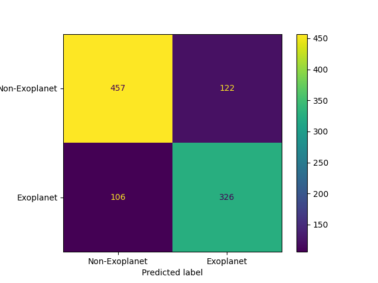
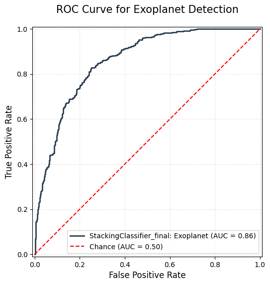

# Exoplanets Detection API

A production-ready machine learning API for exoplanet detection, built with FastAPI and containerized for deployment.

## Project Overview
This project demonstrates an end-to-end MLOps workflow for a machine learning model. The model is trained using **MLflow** for experiment tracking and versioning, and then packaged as a static artifact within an immutable Docker container for production inference.

## Tech Stack

- Python
- FastAPI
- Scikit-learn
- MLflow
- Docker
- Lightkurve
- NumPy / Pandas

## Data Pipeline
This project includes a robust pipeline to transform raw data into a model-ready format. 

1. **Data Acquisition:** The collected data has been extracted directly from the NASA Exoplanet Archive (http://exoplanetarchive.ipac.caltech.edu) for retrieving the KIC ID (identifier for each observed object) and using the library lightkurve to extract the corresponding flux for each observation.
2. **Preprocessing:** - Cleaning and processing: A Savitzky-Golay filter has been applied to each lightcurve object to smooth it, then they have been folded given their period and epoch time. Finally, they have been truncated to reduce the operating window to observe the dip. Only light curves with sufficient observational coverage were retained. The processed signals were then binned into equal segments to reduce noise while preserving transit information. 
    - Feature Engineering: As the flux data can have up to 17000 observations, after the cleaning and processing, these values are interpolated to 100 points, so all lightcurves have the same number of flux observations. Over these values, certain metrics have been computed to help in the machine learning process, such as skew, kurtosis, standard deviation to transit depth ratio...
3. **Reproducibility:** - The preprocessing logic is encapsulated in `src/preprocessing.py`.

## Key Features
- **Production-Ready Inference:** Zero-dependency model loading (no live tracking server required).
- **Containerized Deployment:** Fully reproducible environment via Docker.
- **Configurable Architecture:** Supports a bundled "production-ready" model with easy overrides via environment variables.
- **MLOps Best Practices:** Decoupled training and inference lifecycles to ensure stability.

## API Usage
The API provides a simple interface to perform real-time exoplanet inference.
- **Endpoint:** `POST /predict`
### Request

```json
{
  "kic_id": "KIC 794830",
  "flux_values": [0.995, 0.987, 0.999]
}
```

### Response

```json
{
  "kic_id": "KIC 794830",
  "is_candidate_for_exoplanet": false,
  "probability_candidate": 0.478
}
```

## How to Run
### Using Docker (Recommended)
1. Build the image:
   `docker build -t exoplanet-api .`
2. Run the container:
   `docker run -p 8000:8000 exoplanet-api`

### Running Locally
1. Install dependencies: `pip install -r requirements.txt`
2. Run the API: `uvicorn src.app:app --reload`
3. To test a different model: `MODEL_PATH=path/to/your/model.pkl uvicorn src.app:app`

## MLOps Design
* **Tracking:** Experiment metadata and parameters are tracked via MLflow. To perform your own experiments, just run a MLflow server locally via `mlflow server -port 8000` and run the file `src/models/train.py` with the desired arguments such as mode, version and model (model name).
* **Serving:** For production, the model is exported as a static binary and packaged within the Docker image. This eliminates runtime network dependencies and ensures sub-millisecond inference times.

## Evaluation and Inference
The production ensemble model has achieved the following metrics during the training phase:



### Performance metrics
| Metric | Score |
| :--- | :--- |
| **Accuracy** | 77.4% |
| **Precision** | 72.8% |
| **Recall** | 75.5% |
| **F1-Score** | 74.1% |
| **Macro F1-Score** | 77% |
| **Average Precision (Precision-Recall)** | 0.80 |

*Interpretation: The model maintains a solid recall of 75.5%, meaning it correctly identifies approximately 3 out of every 4 actual exoplanets, which is a critical metric for astronomical surveys where missing a potential planet is more costly than a false alarm.*

### Results on test set
Out of 1082 objects present in the test dataset, which lack labels (they are neither confirmed exoplanets or false positives yet), the model have identified 401 posibles candidates and flagged 681 as noise.

## License
MIT